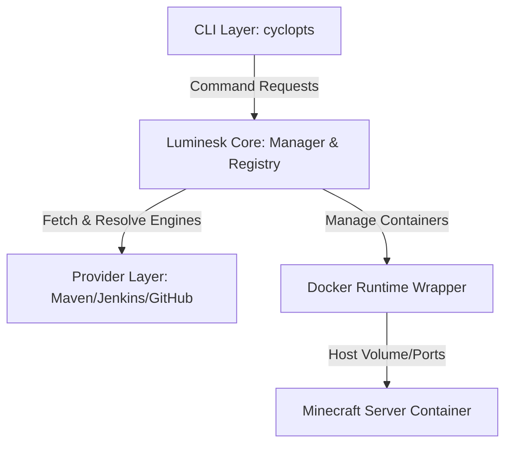

# Architecture

Luminesk is built using a layered architecture that cleanly decouples user commands, state persistence, remote resource tracking, container runtimes, and the underlying server engines.

Below is a diagram illustrating the high-level workflow:

---

## 1. CLI (Command-Line Interface)
The entry point of the tool is built with the **Cyclopts** CLI library. 
- **Responsibility**: Parses arguments and options, handles command routing, prompts user inputs during wizard setups, and renders terminal outputs using the **Rich** console library.
- **Localization**: Before any command runs, it detects the saved user configuration language and loads the matching locale bundle, translating all help messages, CLI options, and console output.

## 2. Luminesk Core
The brain of the system, comprising registry parsing, server state tracking, and operation pipelines:
- **Registry Manager (`registry.py`)**: Responsible for reading the online list of engines, caching it locally to prevent API rate limits, and parsing specific Core configurations.
- **Server Manager (`manager.py`)**: Orchestrates higher-level operations such as creation directory preparation, core updates, engine transitions, server deletions, and runtime state synchronizations.
- **Config Store (`config.py`)**: Direct interface with a local SQLite database that stores settings and metadata of all registered servers.

## 3. Provider Layer
Defines integration models for pulling engine binaries from different remote release channels:
- **Maven**: Resolves packages and SNAPSHOT versions by parsing metadata XML files (e.g. Nukkit, PowerNukkitX, and Lumi).
- **Jenkins**: Crawls Jenkins job endpoints to locate successful build artifacts (e.g. Nukkit-MOT).
- **GitHub Releases**: Queries the GitHub API to locate specific release file patterns.

## 4. Docker Runtime Wrapper
Interfaces directly with your host's Docker binary via subprocess calls:
- **Process Supervision**: Resolves running container state, health, internal container PIDs, and exit codes.
- **Resource Limits**: Computes physical memory constraints and injects limits using Docker `--memory` flags.
- **Port Mapping**: Manages port bindings (UDP/TCP) depending on host OS conventions.

## 5. Minecraft Server
The leaf node is the actual Nukkit Java archive running inside the Docker container. 
- **Isolation**: It is mounted inside `/server` within the container, meaning configuration modifications, plugins, and worlds are saved directly on the host machine.
- **Supervision**: A custom entrypoint script starts the `java -jar` process, links console commands through a named FIFO pipe, and captures standard log channels.
