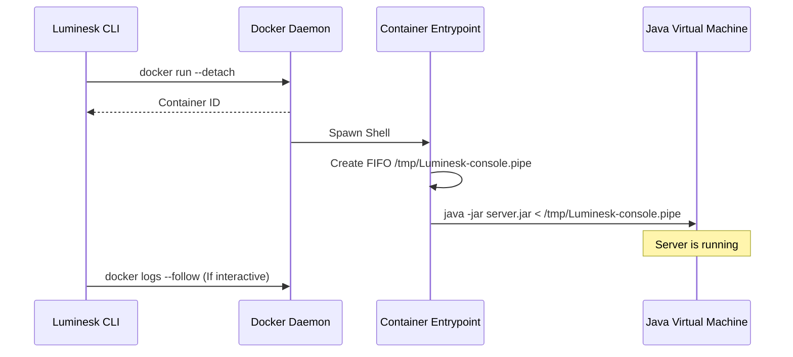

# Runtime Lifecycle

Luminesk runs Minecraft servers inside **Docker** containers. This concept page details why Docker is used, how the containers are constructed, how filesystem mounting works, and how terminal attachment is managed.

---

## Why Docker?

Running Java-based Minecraft Bedrock servers directly on the host machine presents several operational challenges:
1. **Java Version Conflicts**: Different engines require different Java versions (e.g. Nukkit might run on Java 17, while PowerNukkitX requires Java 21). Managing multiple JDKs globally is error-prone.
2. **Resource Constraints**: Java Virtual Machines (JVMs) can easily consume all available system RAM. Setting absolute memory limits on processes natively across Windows, Linux, and macOS is inconsistent.
3. **Daemonization**: Running servers in the background (detached) typically requires wrappers like `tmux`, `screen`, or custom systemd services.

Docker solves these problems by isolating the environment, packaging the exact required Java runtime inside a lightweight image, and enforcing native OS-level CPU/memory constraints.

---

## Container Creation & Mounts

When you execute `nesk start <tag>`, Luminesk generates a `docker run` command dynamically:

```bash
docker run \
  --detach \
  --interactive \
  --name Luminesk-my-server \
  --memory 1g \
  --volume /absolute/path/to/server:/server \
  --workdir /server \
  ...
```

### Filesystem Volume Mount
The server directory on your host machine is mounted directly to `/server` inside the container:
- **Persistence**: All server configuration files (like `server.properties`), plugins, players database, and world files are saved on your host system. 
- **Safety**: If you delete, recreate, or update the Docker container, **no server data is lost**. Only the execution wrapper changes.

---

## Startup and Detached Mode

Every container is launched in **detached** mode (`--detach` flag) in the background.



### The FIFO Pipe Input Trick
By default, Docker container stdin is difficult to write to programmatically once detached. To enable clean command injection (like sending `stop` or plugin commands), the Luminesk entrypoint script does the following inside the container:
1. Creates a named FIFO pipe at `/tmp/Luminesk-console.pipe`.
2. Starts the Java process, redirecting its stdin: `java -jar server.jar < /tmp/Luminesk-console.pipe`.
3. When you run `nesk stop <tag>`, Luminesk calls `docker exec` to write directly into that pipe:
   ```bash
   printf "stop\n" > /tmp/Luminesk-console.pipe
   ```
This allows graceful console command injection from the outside!
