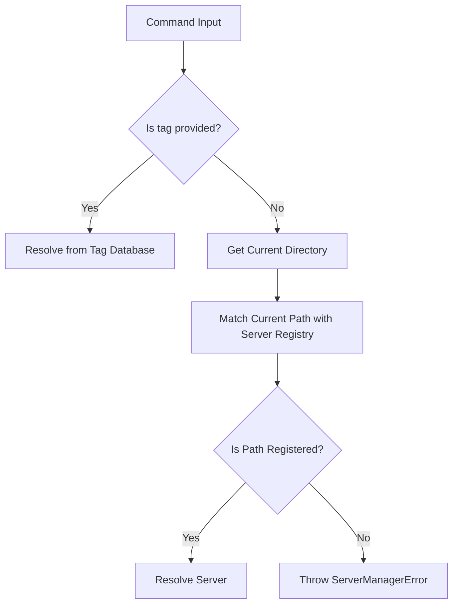

# Server Tags & Name Resolution

Luminesk uses **Tags** to target specific server profiles. This page details how tags are validated, resolved by CLI commands, and kept unique.

---

## Tag Syntax Validation

To prevent formatting issues in directories and container environments, server tags must follow strict syntax validation:
- **Character Constraint**: Only alphanumeric characters, hyphens (`-`), underscores (`_`), and dots (`.`) are allowed.
- **Case-Insensitive**: All tags are stored and matched in **lowercase** format.
- **Regex Enforcement**: Checked via `^[a-zA-Z0-9\-_.]+$` on inputs.

---

## Name Resolution Flow

When you run a command like `nesk start [target]`, Luminesk resolves the target server using a structured flow:

### PID-Based Resolution (For Stop/Kill)
For commands like `stop` and `kill`, you can also pass a **PID** (Process ID) instead of a tag. Luminesk will scan all active registered servers to locate the one matching that system PID.

---

## Collision Prevention

Every tag in the registry must be unique. Luminesk implements collision prevention during creation:
1. **Wizard Proposals**: The creation wizard automatically suggests a default tag based on the core ID (e.g. `server-nukkit`).
2. **Auto-Incrementing**: If the suggested tag is already registered in the database, Luminesk increments a counter suffix until a free tag is found:
   - `server-nukkit` (taken)
   - `server-nukkit-1` (taken)
   - `server-nukkit-2` (free -> proposed as default)
3. **Registration Guard**: If you attempt to register a server using a tag that is already in use, the transaction is rejected to prevent database pollution.
