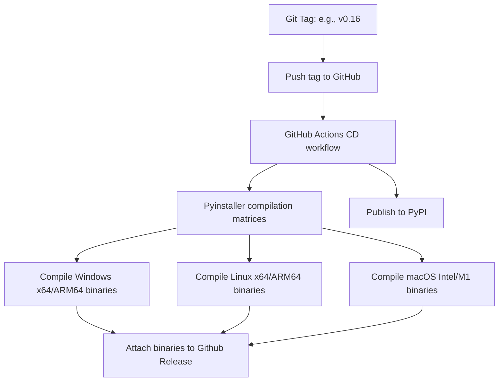

# Release Process

This page describes the automated testing, tag versioning, and distribution workflows used to publish **Luminesk**.

---

## Branching Model

Luminesk development is structured around two main branches:
- **`dev`**: The active integration branch. All new features, bug fixes, and documentation edits are merged here first.
- **`main`**: The stable branch reflecting the latest public release.

---

## Continuous Integration (CI)

Every commit pushed to the `dev` or `main` branches, and every Pull Request, triggers the automated CI pipeline (`ci.yml`):
1. **Linter & Style Checks**: Runs code style compliance audits.
2. **Automated Testing**: Executes the test suites on Python versions `3.13` across Linux, macOS, and Windows.
3. **Coverage Report**: Generates test coverage matrices.

---

## Automated Deployment (CD)

When a release is ready, the maintainer triggers the deployment workflow:

### Build Outputs:
- **PyPI Release**: Instantly available via `pip install Luminesk`.
- **GitHub Release Page**: Hosts 6 compiled executables:
  - `Luminesk-windows-amd64.exe`
  - `Luminesk-windows-arm64.exe`
  - `Luminesk-linux-amd64`
  - `Luminesk-linux-arm64`
  - `Luminesk-darwin-amd64`
  - `Luminesk-darwin-arm64`
